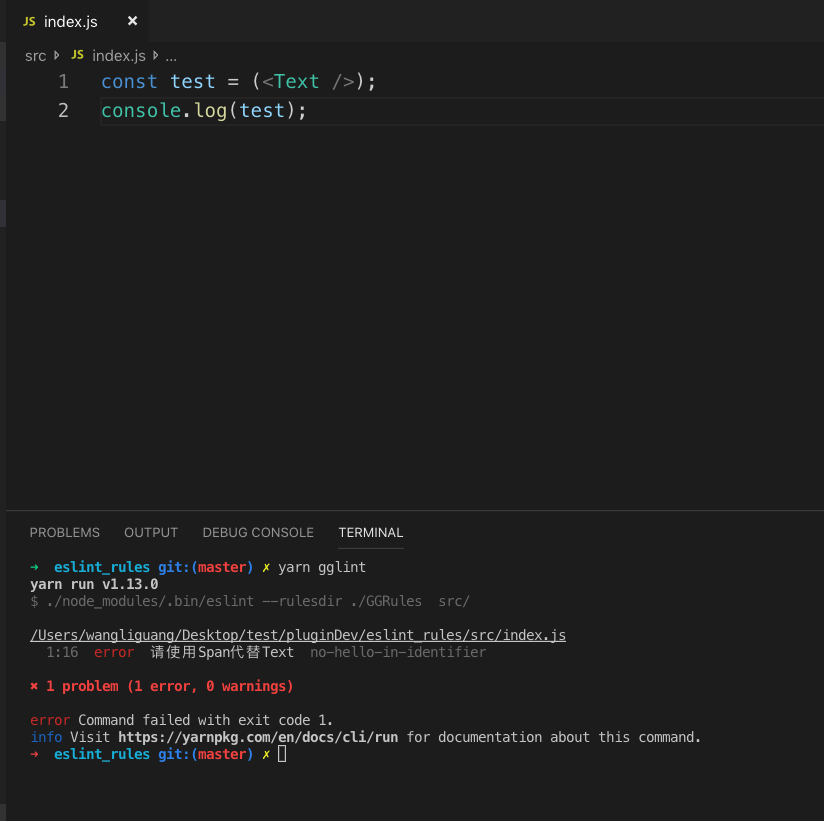

# gglint

> 在团队开发中，经常会碰到这样的场景：
> 1. 来一个新人，碰到需求需要处理日期，但不知道项目中已经有封装好的日期库，就自己做了一个轮子
> 2. 又来一个新人，碰到弹层用官方的是Modal，但他不知道项目中已经根据项目特色做了一个Modal😿😿

 上诉的场景有两种解决方式
  1. 入库前认真Review代码
  2. 自动化检测
 
 相对于人，我更相信机器，所以我选择第二种方式，具体实现是：**基于ESlint在项目中扩展自己的ESlint规则**，效果图如下：

备注：`yarn gglint`命令是我定义到package.json中的命令